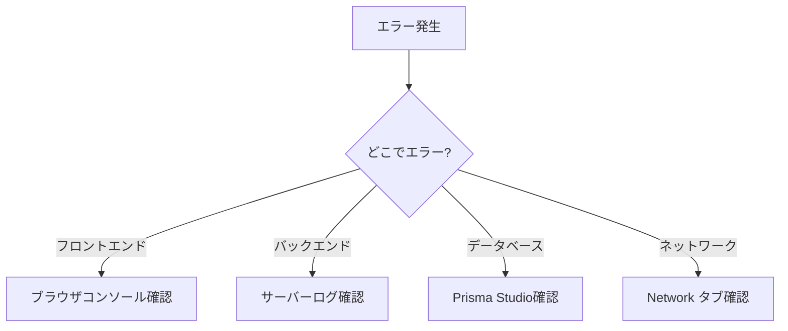

# デバッグガイド - 薬剤師マッチングプラットフォーム

> 最終更新日: 2025 年 11 月 26 日

---

## 📋 目次

1. [デバッグの基本フロー](#デバッグの基本フロー)
2. [エラー報告の方法](#エラー報告の方法)
3. [よくあるエラーと解決法](#よくあるエラーと解決法)
4. [デバッグツール](#デバッグツール)

---

## デバッグの基本フロー

### 1. エラーの特定



### 2. エラー情報の収集

#### フロントエンド（Next.js）

```bash
# 開発サーバー起動
npm run dev

# ブラウザで確認
# 1. F12 で開発者ツールを開く
# 2. Console タブでエラーメッセージを確認
# 3. Network タブで API リクエストを確認
```

**確認ポイント：**

- ❌ `TypeError: Cannot read property 'xxx' of undefined`
- ❌ `Network Error` または `Request failed with status code 500`
- ❌ `Hydration failed` または `Text content did not match`

#### バックエンド（Express.js）

```bash
cd backend
npm start

# ターミナルでログを確認
```

**確認ポイント：**

- ❌ `Error: Cannot connect to database`
- ❌ `TypeError: xxx is not a function`
- ❌ `UnhandledPromiseRejectionWarning`

#### データベース（Prisma）

```bash
# Prisma Studio でデータを確認
npx prisma studio

# スキーマの確認
npx prisma generate
```

---

## エラー報告の方法

### 🎯 判断フローチャート

```
エラーを発見
    ↓
【質問1】エラーは何個ある？
    ├─ 1個 → パターンB（詳細報告）
    └─ 複数 → 次へ
        ↓
【質問2】エラーは関連している？
    ├─ YES → パターンA（まとめて報告）
    └─ NO → 次へ
        ↓
【質問3】致命的なエラーがある？
    ├─ YES → パターンC（優先度別報告）
    └─ NO → パターンA（まとめて報告）
```

---

### パターン A: 複数エラーをまとめて報告

**使用シーン：**

- 関連する複数のエラー
- 同じ機能内の複数のバグ
- 初回のエラー報告

**テンプレート：**

```markdown
## 発生しているエラー（3 件）

### 🔴 エラー 1: [タイトル]

- **場所**: ファイルパス
- **症状**: 何が起きているか
- **エラーメッセージ**:
```

エラーメッセージをここに

```
- **再現手順**:
1. 手順1
2. 手順2
- **優先度**: 高

### 🟡 エラー2: [タイトル]
（同様に記載）

### 🟢 エラー3: [タイトル]
（同様に記載）

これらのエラーを修正してください。
```

---

### パターン B: 一つずつ詳細報告

**使用シーン：**

- 複雑なエラー
- 原因不明のエラー
- 再現が難しいエラー

**テンプレート：**

```markdown
## エラー: [具体的なタイトル]

### 基本情報

- **発生箇所**: `app/auth/login/page.tsx` の 45 行目
- **優先度**: 🔴 高
- **影響範囲**: ログイン機能全体

### 再現手順

1. http://localhost:3000/auth/login にアクセス
2. メールアドレス: `test@example.com` を入力
3. パスワード: `password123` を入力
4. 「ログイン」ボタンをクリック
5. エラーが発生

### エラーメッセージ
```

Error: Network Error
at createError (axios.js:25)
at settle (axios.js:12)
at XMLHttpRequest.handleLoad (axios.js:61)

```

### 期待される動作
ログイン成功後、ユーザータイプに応じたダッシュボードにリダイレクトされる

### 試したこと
- [ ] バックエンドが起動していることを確認
- [ ] API URLが正しいことを確認（`http://localhost:3001`）
- [ ] ネットワークタブで確認 → リクエストが送信されていない

### 環境情報
- OS: macOS 24.5.0
- ブラウザ: Chrome 120
- Node.js: v18.x
- フロントエンド: http://localhost:3000
- バックエンド: http://localhost:3001

### スクリーンショット
（可能であれば添付）

このエラーを修正してください。
```

---

### パターン C: 優先度別報告

**使用シーン：**

- 致命的エラーと軽微なエラーが混在
- 段階的な修正が必要な場合

**テンプレート：**

```markdown
## エラーリスト（優先度順）

### 🔴 致命的エラー（すぐに修正が必要）

#### 1. ログイン機能が完全に動かない

- 詳細: [パターン B の形式で記載]

### 🟡 重要なエラー（早めの修正が必要）

#### 2. 証明書画像が表示されない

- 詳細: [パターン B の形式で記載]

#### 3. カレンダーの日付がずれる

- 詳細: [パターン B の形式で記載]

### 🟢 軽微なエラー（時間があれば修正）

#### 4. ボタンのスタイルが崩れる

- 詳細: [簡易的に記載]

まずは 🔴 の致命的エラーから修正してください。
```

---

## よくあるエラーと解決法

### 1. ネットワークエラー（Network Error）

**症状：**

```
Error: Network Error
```

**原因：**

- バックエンドが起動していない
- API URL が間違っている
- CORS エラー

**解決法：**

```bash
# 1. バックエンドが起動しているか確認
cd backend
npm start

# 2. フロントエンドの環境変数を確認
cat .env.local
# NEXT_PUBLIC_API_URL=http://localhost:3001 が設定されているか

# 3. バックエンドのCORS設定を確認
# backend/src/app.js
```

---

### 2. データベース接続エラー

**症状：**

```
Error: Can't reach database server
```

**原因：**

- データベースが起動していない
- DATABASE_URL が間違っている
- ネットワーク接続の問題

**解決法：**

```bash
# 1. 環境変数の確認
cat backend/.env
# DATABASE_URL が正しいか確認

# 2. Prisma接続テスト
npx prisma db pull

# 3. 既知の問題: Prisma Accelerate使用時
# → IMPLEMENTATION_SUMMARY.md の「既知の問題」参照
```

---

### 3. 認証エラー（401 Unauthorized）

**症状：**

```
Error: Request failed with status code 401
```

**原因：**

- トークンが期限切れ
- トークンが保存されていない
- トークンが無効

**解決法：**

```javascript
// 1. ブラウザのlocalStorageを確認
// F12 → Application → Local Storage → token

// 2. トークンの有効期限を確認（JWT_SECRET）
// backend/.env の JWT_SECRET が正しいか

// 3. ログアウトして再ログイン
```

---

### 4. ファイルアップロードエラー

**症状：**

```
Error: File too large
Error: Invalid file type
```

**原因：**

- ファイルサイズが 10MB を超えている
- 対応していないファイル形式

**解決法：**

```javascript
// クライアント側の圧縮が動作しているか確認
// app/pharmacist/dashboard/page.tsx

// サーバー側のファイルサイズ制限を確認
// backend/src/routes/uploads.js
// limits: { fileSize: 10 * 1024 * 1024 }
```

---

### 5. Hydration エラー（Next.js）

**症状：**

```
Error: Hydration failed because the initial UI does not match what was rendered on the server
```

**原因：**

- サーバーとクライアントで異なる HTML が生成されている
- useEffect 内で DOM を直接操作している

**解決法：**

```javascript
// 1. 'use client' ディレクティブを追加
'use client'

// 2. useEffectで状態を初期化
const [mounted, setMounted] = useState(false)
useEffect(() => {
  setMounted(true)
}, [])

if (!mounted) return null

// 3. suppressHydrationWarning を使用（最終手段）
<div suppressHydrationWarning>
  {content}
</div>
```

---

## デバッグツール

### 1. ブラウザ開発者ツール

**Chrome DevTools:**

- **Console**: エラーログ、console.log 出力
- **Network**: API リクエスト/レスポンス
- **Application**: localStorage, Cookie 確認
- **Sources**: ブレークポイント設定

**ショートカット:**

- `F12` - DevTools を開く
- `Cmd + Shift + C` (Mac) - 要素を選択
- `Cmd + Option + J` (Mac) - コンソールを開く

---

### 2. React Developer Tools

**インストール：**

```bash
# Chrome拡張機能
# https://chrome.google.com/webstore
# 「React Developer Tools」を検索してインストール
```

**使い方：**

- コンポーネントツリーを表示
- Props と state を確認
- フックの状態を確認

---

### 3. Prisma Studio

**起動方法：**

```bash
npx prisma studio
# → http://localhost:5555 で起動
```

**機能：**

- データベースの中身を視覚的に確認
- データの編集・削除
- リレーションの確認

---

### 4. デバッグログの追加

#### フロントエンド

```typescript
// API呼び出し時
try {
  console.log("🚀 API Request:", { url, method, data });
  const response = await apiCall();
  console.log("✅ API Response:", response.data);
  return response.data;
} catch (error) {
  console.error("❌ API Error:", error);
  console.error("Error details:", error.response?.data);
  throw error;
}
```

#### バックエンド

```javascript
// コントローラー内
exports.someFunction = async (req, res) => {
  try {
    console.log("📥 Request:", {
      user: req.user.id,
      body: req.body,
      params: req.params,
    });

    const result = await someOperation();

    console.log("📤 Response:", result);
    res.json(result);
  } catch (error) {
    console.error("❌ Error:", error.message);
    console.error("Stack:", error.stack);
    res.status(500).json({ error: error.message });
  }
};
```

---

## 推奨デバッグフロー（実践編）

### ケーススタディ: ログインエラーの場合

```
【ステップ1】エラーを再現
→ ログイン画面で実際にエラーを発生させる

【ステップ2】フロントエンドを確認
→ ブラウザコンソールでエラーメッセージを確認
→ Networkタブでリクエストを確認

【ステップ3】バックエンドを確認
→ サーバーログでエラーを確認
→ API エンドポイントが正しいか確認

【ステップ4】データベースを確認
→ Prisma Studio でユーザーデータを確認

【ステップ5】エラーを報告
→ 上記のパターンを使って報告
→ 複雑な場合はパターンB（詳細報告）

【ステップ6】修正を確認
→ 修正後、再度テスト
→ 他の機能への影響がないか確認
```

---

## まとめ：エラー報告の判断基準

| 状況                   | 推奨方法                       | 理由               |
| ---------------------- | ------------------------------ | ------------------ |
| 初めてのエラー発見     | **パターン A**（まとめて報告） | 全体像を把握できる |
| 関連する 3 つのエラー  | **パターン A**（まとめて報告） | 一度に効率的に修正 |
| 原因不明の複雑なエラー | **パターン B**（詳細報告）     | 詳細情報が必要     |
| 致命的 + 軽微なエラー  | **パターン C**（優先度別）     | 段階的に修正       |
| 単一の重要なエラー     | **パターン B**（詳細報告）     | 確実に修正         |

---

## チェックリスト

### エラー報告前の確認事項

- [ ] エラーメッセージをコピーした
- [ ] 再現手順を確認した
- [ ] 環境情報を確認した（OS, ブラウザ, Node.js バージョン）
- [ ] バックエンドが起動しているか確認した
- [ ] 環境変数が正しく設定されているか確認した
- [ ] ブラウザのキャッシュをクリアした
- [ ] 必要に応じてスクリーンショットを撮った

---

**最終更新:** 2025 年 11 月 26 日  
**バージョン:** 1.0.0
